# ZenGit
[日本語](./README_jp.md)
<div style="text-align: center;">
    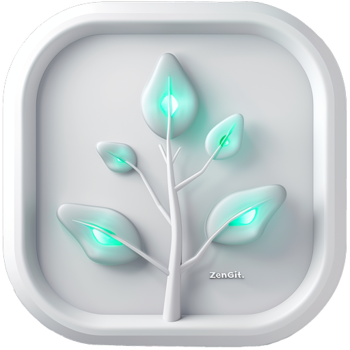
</div>

**A simple git client designed for smooth operation.**

(*Note: [git](https://git-scm.com/) is not included and must be installed separately.*)

## Features Description

## Menu
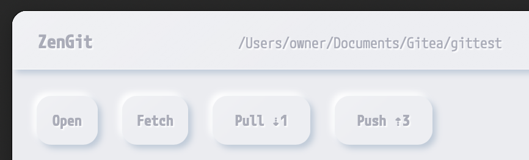

- **Title Bar**: Displays the currently opened git project folder.
- **Open**: Selects a git project folder.
- **Fetch**: Fetches the repository (does not merge).
- **Pull**: Pulls the repository. Displays the number of commits the remote branch is ahead of the current branch.
- **Push**: Pushes the repository. Displays the number of commits the current branch is ahead of the remote branch.

## Modes
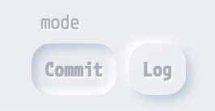

- **Commit Mode**: Mode for commit-related operations.
- **Log Mode**: Mode for displaying logs and branch operations.

## Commit Mode
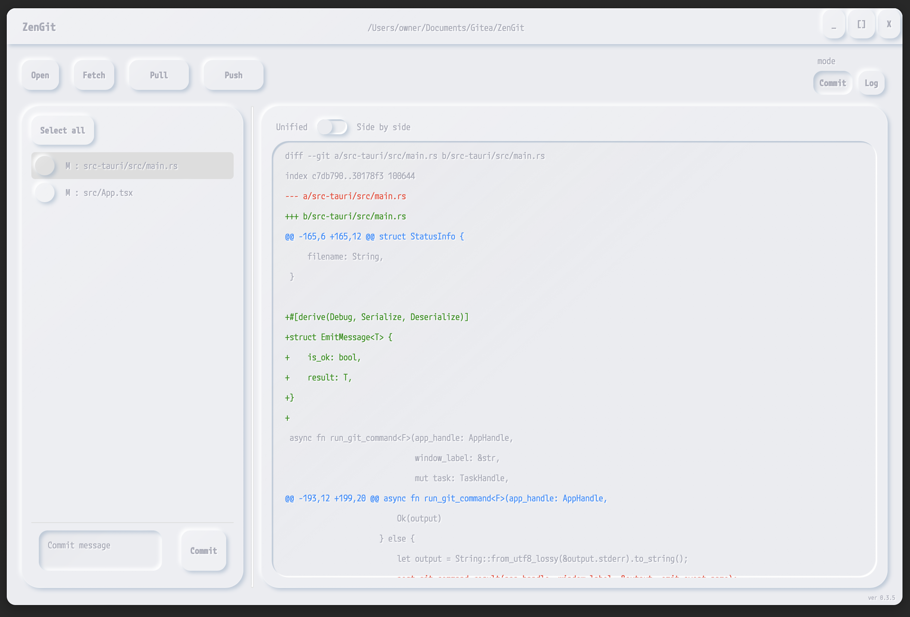

Displays commit operations and change differences.

### Change File List
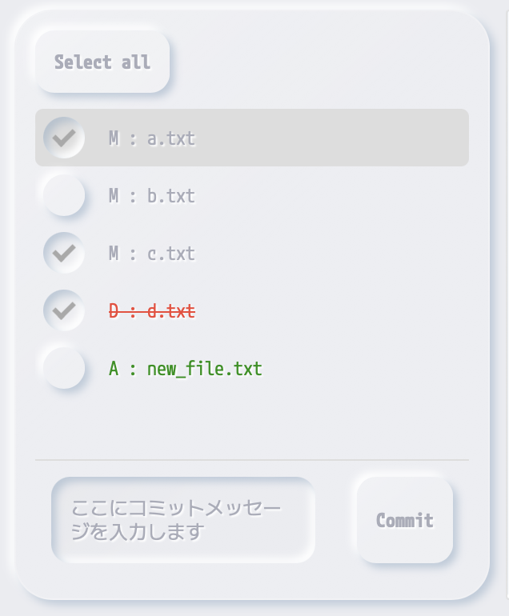

This panel displays the difference files. The change type is determined by the first character of the file name.
```
M: Modified
A: Added
D: Deleted
```
### How to Commit
Check the files you want to commit, enter a commit message, and commit using the commit button.

> [!NOTE]
> If you press the commit button without entering a commit message, it will combine with the previous commit.

### Right-Click Menu
- Discard Changes: Discards changes. For added differences, deletes the file.
- Open File Location: Opens the file location in Explorer.

### Difference Display Panel
- **Unified**: Displays differences in a unified format.

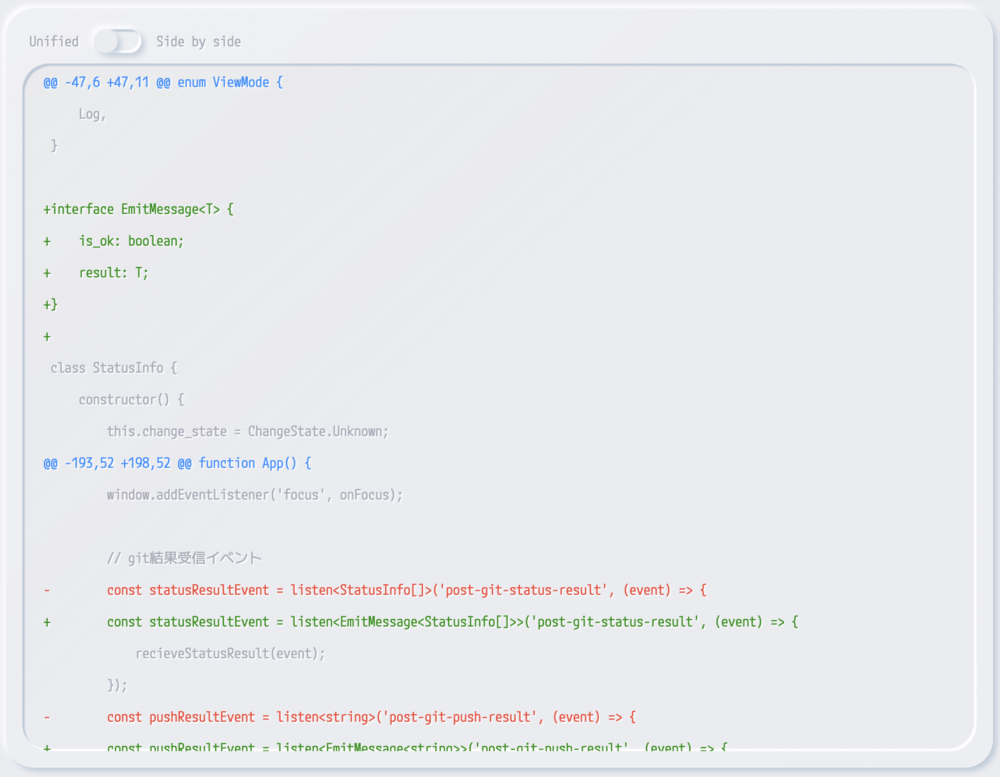

- **Side by Side**: Displays differences side by side.

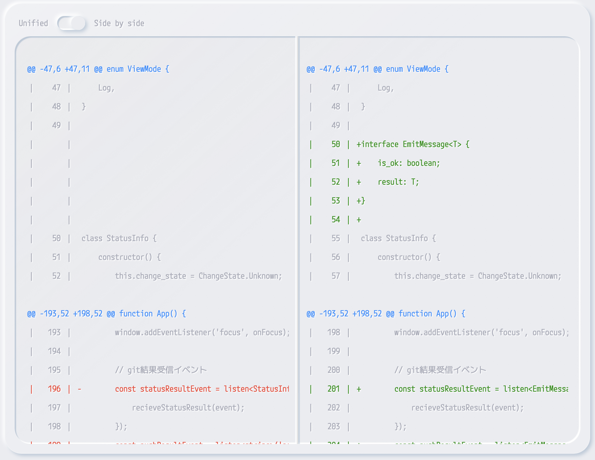

## Log Mode
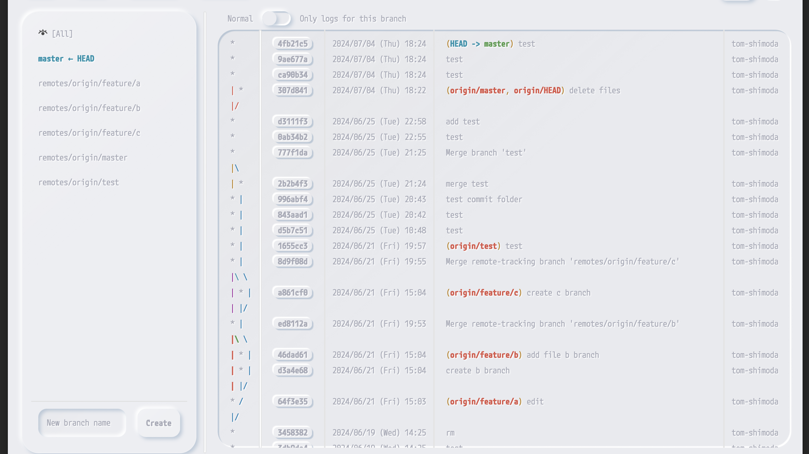

Displays all branches and their logs.

### Branch Panel
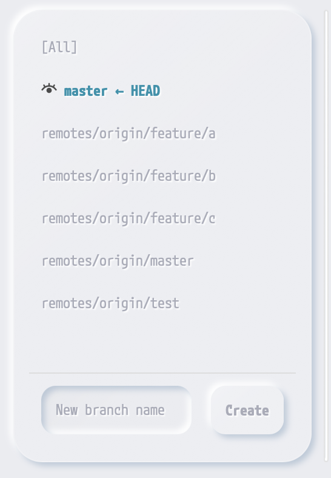

Clicking on a branch switches the log display to that branch.
- Selecting [All] displays logs for all branches.
- The branch with the eye icon is the currently displayed branch.
- The branch labeled "xxxx ← HEAD" is the currently checked-out branch.
- Branches starting with "remotes/" are remote branches.

#### Right-Click Menu
The right-click menu content differs slightly between local and remote branches.
- **Checkout**: Checks out the branch. For remote branches, creates a local branch with the same name and checks it out.
- **Merge This Branch into Current Branch**: Merges the right-clicked branch into the currently checked-out branch (the branch with the HEAD label).
- **Delete**: Deletes the branch.

### Log Panel
Clicking the hash button displays the commit changes in a separate window.

#### [Normal <-> Only logs for this branch] Switch
Normal: Displays the normal log.
Only logs for this branch: Displays logs only for this branch, excluding commits merged from other branches.

#### Right-Click Menu
1. From the right-click menu on the log, you can check out a specific commit.
<div style="text-align: center;">
    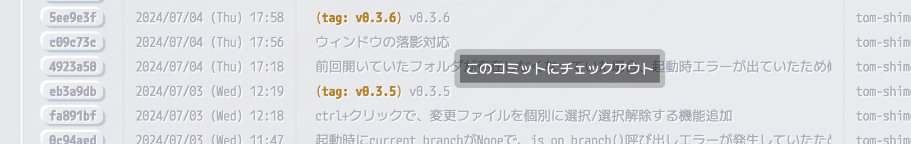
</div>

2. After checking out a specific commit, the branch panel displays like this. You cannot commit in this state. To edit and commit, create a new branch from the current state and work on that branch (a new branch will be created branching from this specific commit).
<div style="text-align: center;">
    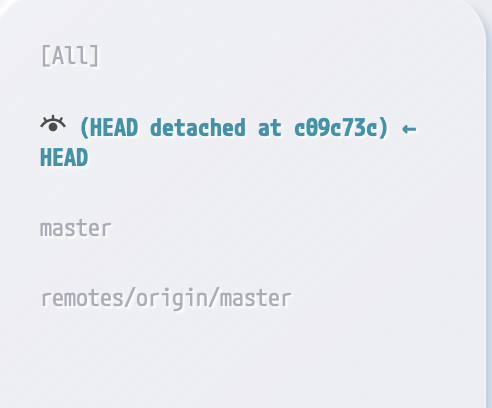
</div>

3. Checking out another branch will return to the normal state.
<div style="text-align: center;">
    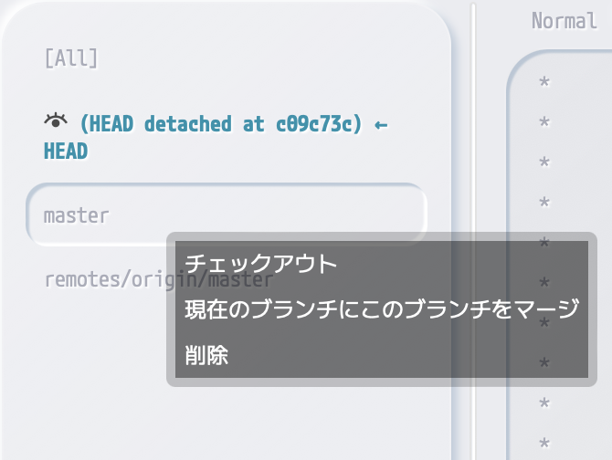
</div>
<div style="text-align: center;">
    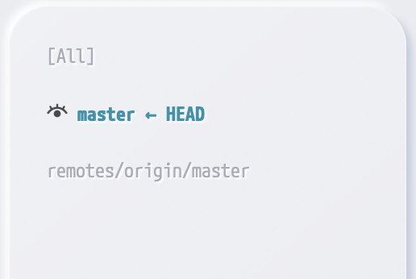
</div>

---

> [!NOTE]
> This application creates a cache folder named "ZenGit" at the following paths.
> If the application does not function properly, try deleting the ZenGit folder.
> ```
> Windows: $HOME\AppData\Roaming\
> macOS: $HOME/Library/Application Support/
> Linux: $XDG_CONFIG_HOME or $HOME/.config/  (not yet confirmed)
> ```
---

## Build Instructions
[Instructions](./how_to_build.md)

---

## License

The copyright holder (hereinafter referred to as the "Copyright Holder") grants permission to use, modify, and redistribute this software under the following conditions.

## Conditions

1. **Permission for Use and Modification**  
   The use and modification of this software are permitted for both commercial and non-commercial purposes.

2. **Permission for Non-Commercial Redistribution**  
   Redistribution of this software, whether modified or not, is permitted for non-commercial purposes, provided that this license is included.

3. **Prohibition of Commercial Redistribution**  
   Redistribution of this software for commercial purposes, whether modified or not, is prohibited.

## Disclaimer

This software is provided "as is," without any express or implied warranties. The Copyright Holder makes no warranties regarding this software and is not liable for any damages arising from its use or related activities.

## License Changes

This license is subject to change without notice. By using this software after any changes, you agree to comply with the revised license terms.
