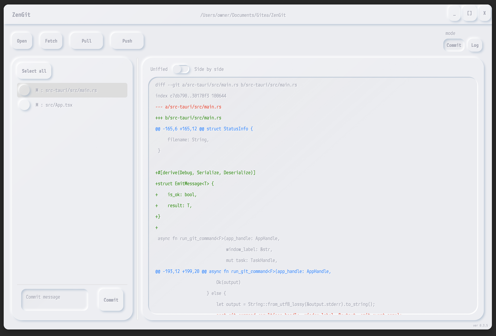
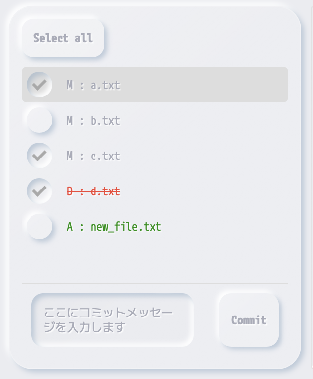
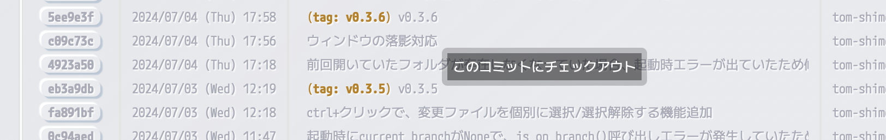
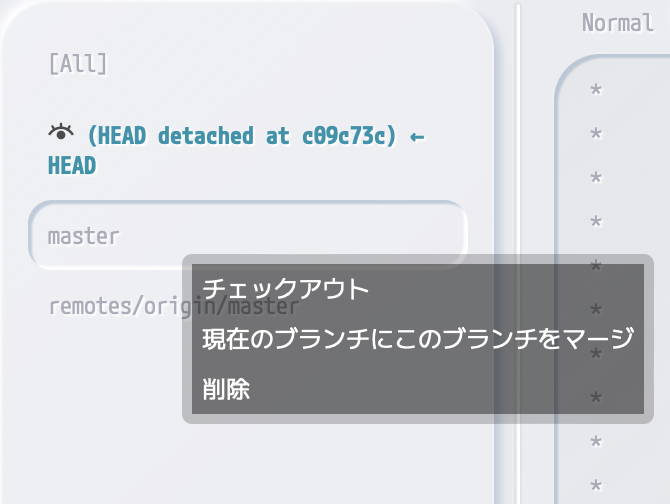

# ZenGit
<div style="text-align: center;">
    
</div>

**軽快な動作を目指したシンプルなgitクライアントです。**  

(※ [git](https://git-scm.com/)は内包しておらず、別途インストールする必要があります。)

## 機能説明

## メニュー


- **タイトルバー**: 現在開いているgitプロジェクトフォルダが表示されます。
- **Open**: gitプロジェクトフォルダを選択します。
- **Fetch**: fetchします。(マージはしません)
- **Pull**: pullします。リモートブランチが現在のブランチより進んでいる数が表示されます。
- **Push**: プッシュします。現在のブランチがリモートブランチより進んでいる数が表示されます。

## モード


- **commitモード**: コミット関連の操作を行うモードです。
- **logモード**: ログの表示や、ブランチ操作を行うモードです。

## commitモード


コミット操作や変更差分の表示を行います。

### 変更ファイル一覧


このパネルには差分ファイルが表示されます。変更内容は、ファイル名の先頭の文字で判断できます。
```
M: 変更
A: 追加
D: 削除
```

### コミット方法
コミットしたいファイルにチェックを入れ、コミットメッセージを入力した後、commitボタンでコミットすることができます。

> [!NOTE]
> コミットメッセージに何も入力せずにcommitボタンを押した場合は、前回のコミットにまとめてコミットすることができます。

### 右クリックメニュー
- 変更を破棄: 変更を破棄します。ファイル追加差分の場合はそのファイルを削除します。
- ファイルの場所を開く: ファイルの場所をエクスプローラーで開きます。

### 差分表示パネル
- **unified**: 通常の差分表示を行います。


- **side by side**: サイド・バイ・サイドで差分表示を行います。


## logモード


全ブランチが一覧表示され、そのログが表示されます。

### ブランチパネル


各ブランチをクリックすることで、そのブランチのログ表示に切り替わります。
- [All]を選択すると、全ブランチのログ表示を行います。
- 目玉アイコンがついているブランチが現在ログ表示を行っているブランチです。
- "xxxx ← HEAD"と表記されているブランチが、現在チェックアウトしているブランチです。
- "remotes/"から始まるブランチはリモートブランチです。

#### 右クリックメニュー
ローカルブランチとリモートブランチで右クリックメニュー内容が少し異なります。
- **チェックアウト**: そのブランチにチェックアウトします。リモートブランチの場合は同名のローカルブランチを作成し、そのブランチにチェックアウトします。
- **現在のブランチにこのブランチをマージ**: 現在チェックアウトしているブランチ(HEAD表記のあるブランチ)に、右クリックしたブランチをマージします。
- **削除**: ブランチを削除します。

### ログパネル
ハッシュボタンを押すと、そのコミットの変更内容を別ウィンドウで表示します。

#### [Normal <-> Only logs for this branch]スイッチ
Normal: 通常のログ表示を行います
Only logs for this branch: そのブランチのログのみ表示します。マージ済みの別ブランチのコミットログは表示されなくなります。

#### 右クリックメニュー
1. ログ上での右クリックメニューより、特定のコミットにチェックアウトすることができます。
<div style="text-align: center;">
    
</div>

2. 特定のコミットにチェックアウトするとブランチパネルがこのような表示になります。この状態でコミットを行うことはできません。編集してコミットを行いたい場合は、現在の状態から新規ブランチを作成し、そのブランチ上で作業を行ってください。(この特定コミットから分岐する形でブランチが生成されます。)
<div style="text-align: center;">
    
</div>

3. この状態で別のブランチをチェックアウトすることで、通常状態に戻ります。
<div style="text-align: center;">
    
</div>
<div style="text-align: center;">
    
</div>

---

> [!NOTE]
> このアプリケーションは以下のパスに"ZenGit"というフォルダのキャッシュを作成します。
> アプリケーションが正常に動かない場合はZenGitフォルダの削除を試してみてください。
> ```
> Windows: $HOME\AppData\Roaming\
> macOS: $HOME/Library/Application Support/
> Linux: $XDG_CONFIG_HOME or $HOME/.config/  (※未確認)
> ```

---

## ビルド手順
[手順](./how_to_build_jp.md)

---
## ライセンス

本ソフトウェアの著作権者（以下、「著作権者」）は、以下の条件に従って本ソフトウェアの使用、改変、再配布を許可します。

## 条件

1. **使用および改変の許可**  
   本ソフトウェアの使用および改変は、営利・非営利を問わず許可されます。

2. **非営利目的での再配布の許可**  
   本ソフトウェアの改変の有無にかかわらず、非営利目的での再配布は許可されます。ただし、再配布時には本ライセンス条項を含める必要があります。

3. **営利目的での再配布の禁止**  
   本ソフトウェアの改変の有無にかかわらず、営利目的での再配布は禁止されます。

## 免責事項

本ソフトウェアは「現状のまま」で提供され、明示または黙示の保証はありません。著作権者は、本ソフトウェアに関していかなる種類の保証も行いません。また、著作権者は、本ソフトウェアの使用またはその他の行為に起因または関連する一切の損害に対して責任を負いません。

## ライセンスの変更

本ライセンスは、予告なく変更される可能性があります。変更後に本ソフトウェアを使用する場合は、変更後のライセンス条項に従う必要があります。
